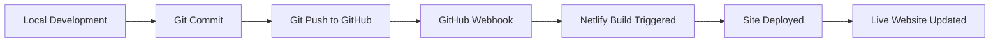

+++
draft = false
date = 2025-08-08T01:30:00Z
title = "Automating Your Workflow: From GitHub Commits to Netlify Deployments"
description = "Learn how to set up automatic deployments from GitHub to Netlify for seamless continuous integration"
slug = "github-netlify-deployment"
authors = ["Damian McNulty"]
tags = ["GitHub", "Netlify", "Deployment", "CI/CD", "Automation"]
categories = ["DevOps", "Web Development"]
externalLink = ""
series = []
+++

## Introduction

In today's fast-paced development environment, automating your deployment pipeline is essential for maintaining productivity and reducing manual errors. This guide will walk you through setting up an automated workflow that commits your code to GitHub and automatically deploys it to Netlify.

## Why Automate Your Deployment?

Before diving into the technical details, let's understand why automation matters:

- **Consistency**: Every deployment follows the same process
- **Speed**: Instant deployments on code changes
- **Reliability**: Reduced human error in deployment process
- **Scalability**: Handle multiple projects efficiently
- **Rollback capability**: Easy to revert problematic deployments

## Prerequisites

Before we begin, ensure you have:

- A GitHub account
- A Netlify account
- Git installed on your local machine
- A project ready for deployment (Hugo, React, Vue, etc.)

## Step 1: Setting Up Your GitHub Repository

### Creating a New Repository

1. Log into your GitHub account
2. Click the "+" icon in the top right corner
3. Select "New repository"
4. Choose a descriptive name for your project
5. Add a README file and .gitignore if needed
6. Click "Create repository"

### Connecting Your Local Project

```bash
# Initialize git in your project directory
git init

# Add your GitHub repository as origin
git remote add origin https://github.com/yourusername/your-repo-name.git

# Add all files to staging
git add .

# Create your first commit
git commit -m "Initial commit: Project setup"

# Push to GitHub
git push -u origin main
```

### Best Practices for Commits

#### Commit Message Structure
Follow this format for clear, professional commit messages:

```
type(scope): description

[optional body]

[optional footer]
```

**Example:**
```bash
git commit -m "feat(blog): add GitHub deployment tutorial

- Added comprehensive guide for GitHub to Netlify workflow
- Included code examples and best practices
- Added troubleshooting section"
```

#### Commit Types
- **feat**: New features
- **fix**: Bug fixes
- **docs**: Documentation changes
- **style**: Code formatting changes
- **refactor**: Code restructuring
- **test**: Adding or modifying tests
- **chore**: Maintenance tasks

## Step 2: Preparing Your Project for Netlify

### Build Configuration

Create a `netlify.toml` file in your project root:

```toml
[build]
  publish = "public"
  command = "hugo --gc --minify"

[build.environment]
  HUGO_VERSION = "0.126.1"
  HUGO_ENV = "production"
  HUGO_ENABLEGITINFO = "true"

[context.production.environment]
  HUGO_BASEURL = "https://your-site-name.netlify.app/"

[context.deploy-preview]
  command = "hugo --gc --minify --buildFuture -b $DEPLOY_PRIME_URL"

[context.branch-deploy]
  command = "hugo --gc --minify -b $DEPLOY_PRIME_URL"

[[headers]]
  for = "/*"
  [headers.values]
    X-Frame-Options = "DENY"
    X-XSS-Protection = "1; mode=block"
    X-Content-Type-Options = "nosniff"
```

### Environment Variables

For projects requiring environment variables:

1. Create a `.env.example` file with placeholder values
2. Add `.env` to your `.gitignore`
3. Set actual values in Netlify's dashboard

Example `.env.example`:
```
API_KEY=your_api_key_here
DATABASE_URL=your_database_url_here
```

## Step 3: Connecting GitHub to Netlify

### Initial Setup

1. **Login to Netlify**
   - Go to [netlify.com](https://netlify.com)
   - Sign up or login with your GitHub account

2. **Import Your Repository**
   - Click "New site from Git"
   - Choose "GitHub" as your provider
   - Authorize Netlify to access your repositories
   - Select your project repository

3. **Configure Build Settings**
   - **Branch to deploy**: `main` (or your default branch)
   - **Build command**: `hugo --gc --minify`
   - **Publish directory**: `public`

4. **Deploy Your Site**
   - Click "Deploy site"
   - Netlify will assign a random subdomain
   - You can customize this later in site settings

### Custom Domain Setup (Optional)

1. Go to "Domain settings" in your Netlify dashboard
2. Click "Add custom domain"
3. Enter your domain name
4. Follow DNS configuration instructions
5. Enable HTTPS (automatic with Let's Encrypt)

## Step 4: Automated Deployment Workflow

### How It Works

Once connected, your workflow becomes:



### Triggering Deployments

Every time you push to your connected branch:

```bash
# Make your changes
git add .
git commit -m "feat(content): add new blog post about deployment"
git push origin main
```

Netlify automatically:
1. Detects the change via webhook
2. Pulls the latest code
3. Runs your build command
4. Deploys to your live site
5. Sends you a notification

### Branch Deployments

Netlify can create preview deployments for feature branches:

```bash
# Create a feature branch
git checkout -b feature/new-design

# Make changes and commit
git add .
git commit -m "feat(design): implement new homepage layout"
git push origin feature/new-design
```

This creates a preview URL like: `https://deploy-preview-123--your-site.netlify.app`

## Step 5: Advanced Configuration

### Build Hooks

For external triggers, create build hooks:

1. Go to "Site settings" → "Build & deploy"
2. Scroll to "Build hooks"
3. Click "Add build hook"
4. Name it and select the branch
5. Use the webhook URL to trigger builds programmatically

Example usage:
```bash
curl -X POST -d {} https://api.netlify.com/build_hooks/your-hook-id
```

### Deploy Previews for Pull Requests

Enable automatic previews for code reviews:

1. In Netlify dashboard, go to "Site settings"
2. Navigate to "Build & deploy" → "Deploy contexts"
3. Enable "Deploy previews"
4. Configure "Branch deploys" as needed

### Notifications

Set up deployment notifications:

1. Go to "Site settings" → "Build & deploy" → "Deploy notifications"
2. Add notifications for:
   - Deploy started
   - Deploy succeeded
   - Deploy failed
3. Choose notification methods (email, Slack, webhook)

## Step 6: Monitoring and Optimization

### Build Performance

Monitor your build times and optimize:

```toml
# In netlify.toml - optimize Hugo builds
[build]
  command = "hugo --gc --minify --enableGitInfo"

[build.environment]
  HUGO_VERSION = "0.126.1"
  GO_VERSION = "1.19"
  NODE_VERSION = "18"
```

### Build Analytics

Track your deployments:
- Build frequency
- Build duration
- Success/failure rates
- Popular deploy times

### Cache Optimization

Leverage Netlify's edge caching:

```toml
[[headers]]
  for = "/css/*"
  [headers.values]
    Cache-Control = "public, max-age=31536000"

[[headers]]
  for = "/js/*"
  [headers.values]
    Cache-Control = "public, max-age=31536000"

[[headers]]
  for = "/images/*"
  [headers.values]
    Cache-Control = "public, max-age=31536000"
```

## Troubleshooting Common Issues

### Build Failures

**Issue**: Build command not found
```bash
# Solution: Specify exact versions in netlify.toml
[build.environment]
  HUGO_VERSION = "0.126.1"
```

**Issue**: Missing dependencies
```bash
# Solution: Add to netlify.toml
[build]
  command = "npm install && hugo --gc --minify"
```

### Git Issues

**Issue**: Large file uploads
```bash
# Solution: Use Git LFS for large files
git lfs track "*.jpg"
git lfs track "*.png"
git lfs track "*.pdf"
```

**Issue**: Merge conflicts
```bash
# Solution: Proper branching strategy
git checkout main
git pull origin main
git checkout your-feature-branch
git rebase main
```

### Performance Issues

**Issue**: Slow builds
- Minimize image sizes
- Use Hugo's image processing
- Implement proper caching
- Remove unused dependencies

## Security Considerations

### Environment Variables

Never commit sensitive data:

```bash
# Add to .gitignore
.env
.env.local
.env.production
```

Use Netlify's environment variable interface for sensitive data.

### HTTPS Configuration

Ensure HTTPS is enabled:
- Automatic with Netlify domains
- Free Let's Encrypt certificates
- Custom domain SSL support

### Content Security Policy

Implement CSP headers:

```toml
[[headers]]
  for = "/*"
  [headers.values]
    Content-Security-Policy = "default-src 'self'; script-src 'self' 'unsafe-inline'"
```

## Best Practices Summary

### Development Workflow
1. Create feature branches for new work
2. Write descriptive commit messages
3. Test locally before pushing
4. Use pull requests for code review
5. Merge only after approval

### Deployment Strategy
1. Use staging environments for testing
2. Implement proper error handling
3. Monitor build performance
4. Set up proper notifications
5. Regular backup strategies

### Code Organization
1. Keep dependencies updated
2. Use semantic versioning
3. Document configuration changes
4. Maintain clean Git history
5. Regular security audits

## Conclusion

Setting up automated deployments from GitHub to Netlify transforms your development workflow, making it more efficient and reliable. This integration provides:

- **Instant feedback** on code changes
- **Collaborative workflows** with deploy previews
- **Professional deployment pipeline** without complex setup
- **Scalable solution** that grows with your project

The time invested in setting up this automation pays dividends in increased productivity and reduced deployment stress. Whether you're working on a personal blog, a client project, or a team application, this workflow provides the foundation for modern web development practices.

Remember to regularly review and update your deployment configuration as your project evolves. Happy coding and deploying!

---

*Have questions about setting up your deployment pipeline? Feel free to reach out or check the official documentation for [GitHub](https://docs.github.com) and [Netlify](https://docs.netlify.com).*
